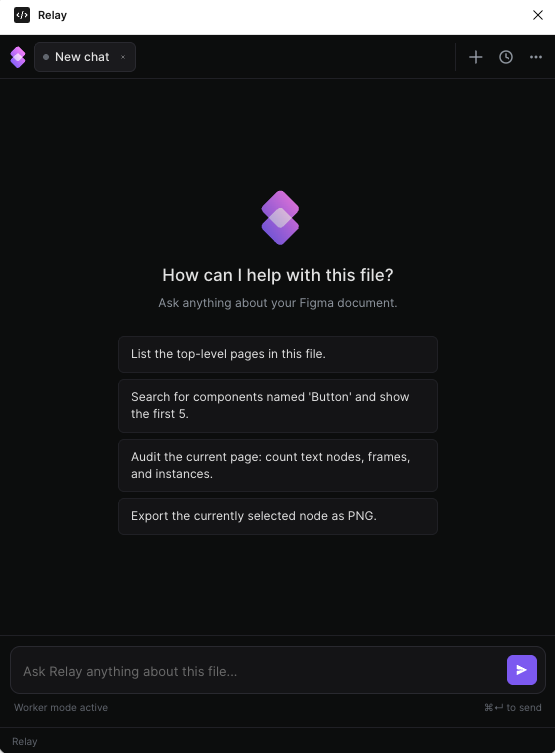
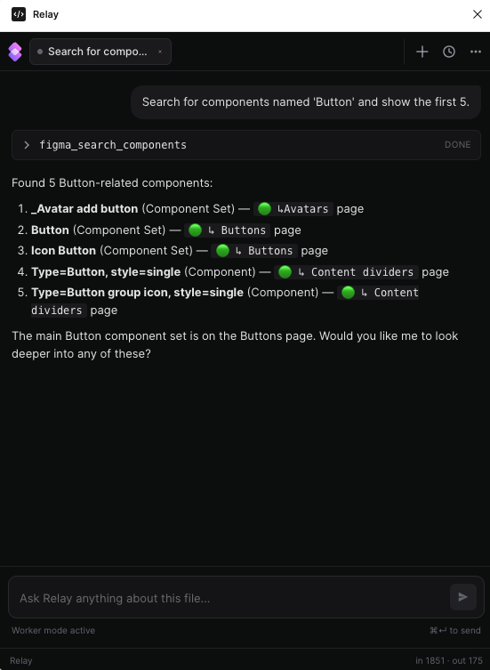
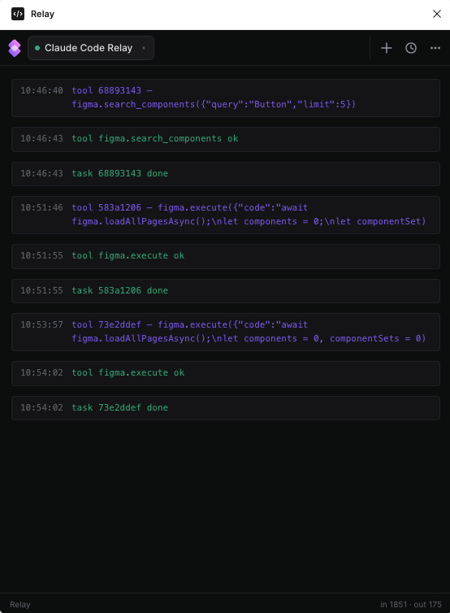

# Relay

Drive Figma from Claude Code. Relay is a localhost bridge that gives Claude Code direct access to your open Figma file: search components, audit token coverage, restyle variants, swap copy across recipes, all without leaving the terminal.

[](https://www.loom.com/share/d4127a4e2df743e7a3a81cfcd37cf477)

## Why Relay

Claude Code is good at reasoning about your codebase but it can't touch your design system. Figma plugins can, but they don't have a terminal, your repo, your CI, or your other tools. Relay is the wire between them.

Once installed, Claude Code can:

- **Build components.** Scaffold new variants, populate slots, wire instance-swap props.
- **Audit components.** Sweep a page for unbound fills, missing focus states, hand-rolled atoms, accessibility regressions.
- **Revise components.** Mass-rename variants, rebind colors to tokens, restyle entire component sets in one prompt.

Everything happens inside the chat where you're already writing code, so there's nothing to copy-paste between tools.

> **No-terminal mode.** Relay also ships with a chat panel inside the plugin. Bring your own Anthropic API key and talk to a Haiku agent with the same tool surface.

## Screenshots

**Empty state.** A new chat with starter prompts.



**Chat with tool call.** Asking about components and getting a real answer back.



**Claude Code activity feed.** Live tool log while Claude Code is driving the file.



## How it works

```
Claude Code  ──▶  MCP server  ──▶  Relay HTTP queue  ──▶  Figma plugin  ──▶  figma.*
                  (stdio)          (127.0.0.1:9226)       (long-poll)
```

Three pieces, all local:

- **`server/`**: Node HTTP relay on `127.0.0.1:9226`. In-memory task queue with long-poll. No state outside the process.
- **`plugin/`**: the Figma plugin. The sandbox executes `figma.*` calls; the UI handles the chat/activity panel and worker polling.
- **`mcp/`**: MCP server that exposes Relay's tools to Claude Code over stdio.

## Quick start

### 1. Run the relay server

Two options. Pick one.

**Option A: install once, run forever (recommended on macOS).** Drops a LaunchAgent so the server boots at login and restarts on crash. No terminal after install.

```sh
bash scripts/install.sh
```

To remove later: `bash scripts/uninstall.sh`. Logs land in `~/Library/Logs/relay.log`.

**Option B: run it manually.** Useful for development on the server itself.

```sh
cd server
npm start
```

Either way, the server listens on `127.0.0.1:9226`. The Claude Code path doesn't need an API key.

### 2. Install the Figma plugin

1. Open Figma desktop.
2. Plugins → Development → Import plugin from manifest…
3. Pick `plugin/manifest.json`.
4. Plugins → Development → Relay to launch.

Worker mode is on by default. The plugin starts polling the relay immediately and shows "Worker idle" until a task arrives.

### 3. Wire up Claude Code

```sh
cd mcp
npm install
```

Register the MCP server with Claude Code:

```sh
claude mcp add relay node /absolute/path/to/relay/mcp/server.js
```

Restart Claude Code, run `/mcp`, confirm `relay` is connected.

### 4. Use it

With your target Figma file open and the plugin running, ask Claude Code about the file:

> Find every Button component in this file and report its variants.
>
> Audit the Chip component set for unbound fills and rebind to Foundry tokens.
>
> Rename every Checkbox recipe label from "Remember me" to "Subscribe to updates".

Claude Code picks the right `mcp__relay__figma_*` tool, the plugin executes against your open document, and the result flows back to the conversation.

## Tools exposed to Claude Code

| Tool | What it does |
|---|---|
| `figma_search_components` | Search COMPONENT / COMPONENT_SET nodes by name |
| `figma_find_node` | Look up a node by id |
| `figma_export_node` | Export PNG / JPG / SVG / PDF (returned as base64) |
| `figma_set_text` | Replace TEXT node characters (loads the right font automatically) |
| `figma_set_fills` | Replace fills array on a node |
| `figma_set_strokes` | Replace strokes array on a node |
| `figma_set_instance_properties` | Set variant / boolean / text / instance-swap props on an INSTANCE |
| `figma_execute` | Escape hatch for arbitrary async snippets inside the plugin sandbox |

Add more by extending the `tools` map in `plugin/code.js` and registering them in `mcp/server.js`.

## No-terminal mode (BYOK chat)

If you'd rather not set up Claude Code, the plugin has a built-in chat panel. On first launch it asks for an Anthropic API key, stored in `figma.clientStorage`. The key is per-device and only ever sent to `api.anthropic.com`.

This is the public-distribution path. Anyone can install the plugin, paste a key, and chat with a Haiku agent that has the same `figma.*` tools as Claude Code.

## Two task shapes

The relay accepts two flavors of `POST /tasks`.

**Direct tool call**, used by the MCP server. No LLM in the plugin loop:

```json
{ "tool": "figma.search_components", "input": { "query": "Button" } }
```

**Natural-language instruction**, used by the in-plugin chat. The plugin runs a Haiku agent loop with the tool whitelist:

```json
{ "instruction": "Find every Button component and list its variants." }
```

Both go through the same queue and worker. Add `?wait=true&timeout=60000` to the POST to block until the task reaches a terminal state. That's how the MCP server makes synchronous tool calls.

## Health check

```sh
curl http://127.0.0.1:9226/health

curl -X POST 'http://127.0.0.1:9226/tasks?wait=true&timeout=10000' \
  -H 'content-type: application/json' \
  -d '{"tool": "figma.search_components", "input": {"query": ""}}'
```

If the plugin is running, the second call returns every component in the open file.

## Design notes

See [`DESIGN.md`](./DESIGN.md) for architectural background: why a localhost queue beats a WebSocket bridge, why Haiku for the in-plugin agent, what the MVP intentionally skips.

## License

[MIT](./LICENSE)
